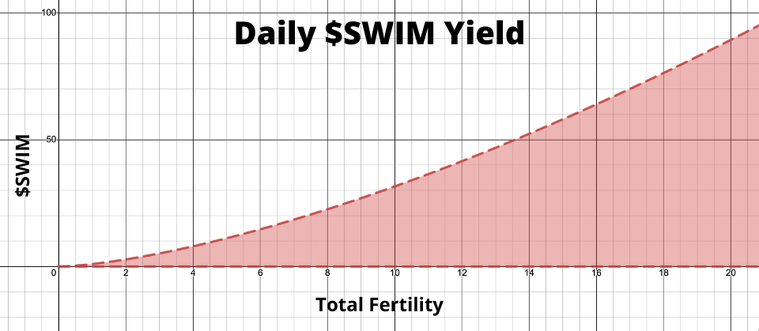

# Holder Perks
{: .no_toc .text-delta }

## Table of contents
{: .no_toc .text-delta }
1. TOC
{:toc}
---

## Overview
Holders of Chin Pokies NFTs will be able to opt-in to our Reward Program (coming soon), which will make them eligible for rewards. These rewards include, but are not limited to, free token-gated digital assets, discounts on merchandising, the generation of $SWIM via our Reward Program, airdrops, raffles, and more.

## Digital Assets and Merchandising
Chin Pokies NFT holders will be granted access to a series of token-gated digital assets being released over time.
In addition, holders also receive a discount on merchandising at our [online store](https://shop.chinpokies.com) once they've connected their wallet. The number of Chin Pokies NFTs held in the wallet determines the discount received. 

NFTs Held        | Discount  |
|:-------------:|:------------------:|
**1** | 10% |
**5** | 15% |
**10** | 20% |

## Fertility

### What is Fertility?

Fertility is an invisible attribute that affects the daily award of $SWIM from our reward program. 
Every Pokie has a fertility score ranging from 1.0 to 10.0. 
Fertility is listed on OpenSea, but does not have a designated rarity. 
The higher the fertility score results in more \$SWIM generated. 

Higher rarity attributes have a higher base Fertility score when being used to calculate a Pokie's fertility.
Fertility score isn't just a number, it's a key component to our algorithm and will help generate tangible rewards as determined by the Team.

### How is Fertility Calculated?

Each Chin Pokie’s Fertility has been by calculated by taking the average of the hidden Fertility score of each individual attribute.
The hidden fertility score of each attribute is calculated when generating each Chin Pokie. Meaning the same attribute most likely has a different hidden Fertility score on different Pokies. The attribute's rarity influences the hidden Fertility as follows:
- **Common -** Randomly generated Fertility between 1-10
- **Uncommon -** Randomly generated Fertility between 1-10 plus 2
- **Rare -** Randomly generated Fertility between 1-10  plus 4
- **Epic -** Randomly generated Fertility between 1-10 plus 6
- **Legendary -** Randomly generated Fertility between 1-10 plus 8
- **Unique Pokies-** Guaranteed Fertility of 10

Example with random numbers.
Chin Pokie#5555 has the following attribute spread:
 - **Rare -**  Randomly generated Fertility between 0-10 + 4 -> (6+4) = 10
 - **Epic -** Randomly generated Fertility between 0-10 + 6 -> (7+6) = 13
 - **Legendary -** Randomly generated Fertility between 0-10 + 8 -> (8+8) = 16
 - **Common -** Randomly generated Fertility between 0-10 -> 1
 - **Common -** Randomly generated Fertility between 0-10 -> 8
 - **Common -** Randomly generated Fertility between 0-10 -> 1
 
The above Chin Pokie’s cumulative fertility is **8.2** (average of the above Fertility scores). 
Final fertility is **capped at 10.** 

## About \$SWIM
Swimmers (\$SWIM) are Chin Pokie specific points that will be used to redeem rewards. [Fertility](/attribute-breakdown#fertility) score will determine how much \$SWIM is generated when Pokies are staked. Additionally, holding multiple Pokies will result in more \$SWIM generated since more fertility will be utilized. \$SWIM is not a token, the $SWIM you acrue are points that are visible from the Chin Pokies website.

## Rewards
Rewards that are redeemable through the aforementioned loylty program include:
1. **Chin Pokies Merchandise** -  merchandise will be 100% redeemable with earned \$SWIM. The only cost for members will be shipping.
2. **Giveaway Access** - members have the opportuity to enter into AL and NFT raffles as well as giveaways for any future releases.
3. **Raffles & Auctions** - Members can use \$SWIM to enter raffles for Allowlist spots, for Gen II Chin Pokies, as well as Allowlist spots for collaborative projects. Additionally, members can bid on limited releases & new collections using \$SWIM.

## \$SWIM Tokenomics
Chin Pokies are committed to implementing a rewards program post-launch. Some of the specifics of how $SWIM works have already been defined and will be explained below. The Reward Program functionality will be implemented post-launch on our website using an allocated percentage of the aforementioned community fund (60% of mint sales).

Maximum staked fertility will be capped at 20, regardless of how many Chin Pokies are held.
- Ex: If Chin Pokies holder stakes 4 NFTs with fertilities of 4, 9, 8, and 5, the total fertility staked will still be 20. 
- Ex: If Chin Pokies holder stakes 2 NFTs with fertilities of 4 and 3,  the total fertility staked will be 7.

\$SWIM will be accrued at a rate of `(Total Fertility Staked)^1.5` each day that once the holder has opted in.

Accrued $SWIM will be collected by redeeming through our website.

| Total Fertility        | Daily \$SWIM Yield  | Total Fertility        | Daily \$SWIM Yield   |
|:-------------:|:------------------:|:-------------:|:------------------:|
| **1** | 1.0 | **11** | 26.5 |
| **2** | 2.8 | **12** | 41.6 |
| **3** | 5.2 | **13** | 46.9 |
| **4** | 8.0 | **14** | 52.4 |
| **5** | 11.2 | **15** | 58.1 |
| **6** | 14.7 | **16** | 64.0 |
| **7** | 18.5 | **17** | 70.1 |
| **8** | 22.6 | **18** | 76.4 |
| **9** | 27.0 | **19** | 82.8 |
| **10** | 31.6 | **20** | 89.4 |

